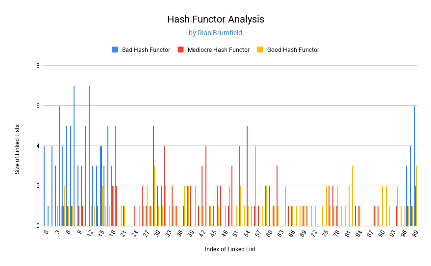

#Assignment 06 Analysis Document
###by Rian Brumfield

1. Explain the hashing function you used for BadHashFunctor. Be sure to discuss
   why you expected it to perform badly (i.e., result in many collisions).

**For the bad hashing function, I wrote a function that determines the index only by using the first letter of the string. I expect this to perform badly because every word that starts with the same letter will result in a collision. The bad hashing function is especially bad when the hash table is greater than size 26 because there are only 26 letters (or 52 if you cound capital and non-capital letters). This means that the same 26 (or 52) indices will be chosen, causing many collisions and leaving many indices empty.**

2. Explain the hashing function you used for MediocreHashFunctor. Be sure to
   discuss why you expected it to perform moderately (i.e., result in some
   collisions).

**For the mediocre hash function, I chose to sum every character in the string before modding to find the index. I expect this to perform better than the bad hash functions because we are no longer guaranteed a collision when strings share the first letter. Also, the chosed indiced will be more evenly distributed throughout large arrays, not restricted to 26 or 52 indices. However, I still expect collisions because some words which differ in characters and size can still sum to the same number. Therefore, every string that shares a sum will collide with each other.**

3. Explain the hashing function you used for GoodHashFunctor. Be sure to
   discuss why you expected it to perform well (i.e., result in few or no
   collisions).

**For the good hash function, I chose to use a prime number, 47, as a multiplier before adding the value of each character. Because the prime number has no factors, it reduces the likelyhood of the sum dividing evenly. Using the sum of the chars of the string ensures that the index chosen is (partially) unique to the string. This method can still result in collisions, but hopefully much less than the mad or mediocre methods. All three functors are guaranteed to have come colisions because the rehash is not implemented in my method.**

4. Design and conduct an experiment to assess the quality and efficiency of
   each of your three hash functions. Briefly explain the design of your
   experiment.  Plot the results of your experiment. Since the organization of
   your plot(s) is not specified here, the labels and titles of your plot(s), as
   well as, your interpretation of the plots is important. A recommendation for
   this experiment is to create two plots: one that shows the number of collisions
   incurred by each hash function for a variety of hash table sizes, and one that
   shows the actual running time required by various operations using each hash
   function for a variety of hash table sizes. 

  
   **For my experimental design, I created three Hash Tables using the three different hash functors. All tables shared a capacity of 100 and the same data of 97 Strings was added to all three tables. The graph below illustrates the results of the experiment.**
     
   
     
**The graph above maps the size of the linked lists at each index of the backing array. If a linked list is size 1, then no collision occured. Every increase of 1 in the size after that represents the number of collisions that occured at that index.**
  

***Bad Hash Functor Analysis:***
**The bad functor resulted in the most collisions and the most unused indices, confirming it as the worst of the three functors. The bad functor methos resuted in 77 unused indicies and a maximum of 6 collisions at one index.**
  

***Mediocre Hash Functor Analysis:***
**The mediocre functor performed better than the bad functor. The mediocre hash functor resulted in only 45 unused indices with a maximum number of 4 collisions at one index. The chosen indices are also more evenly distributed than the bad functor.**
  

***Good Hash Functor Analysis:***
**The good hash function performed the best of all three functors. It resulted in only 31 unused indices and a maximum of 3 collisions at one index.**
  

5. What is the cost of each of your three hash functions (in Big-O notation)?
   Note that the problem size (N) for your hash functions is the length of the
   String, and has nothing to do with the hash table itself. 

***The Bad Hash Function is O(1)*** **because the functor only accesses the first letter of the string, which is an order one operation, and takes the modulo by the capacity of the array, also an order one operation.**

***The Mediocre Hash Function is O(N)*** **because the functor uses a for loop to access every character in the String, which is an order N operation.  The functor also uses other order one operations like addition and taking the modulo by the capacity of the array.**

***The Good Hash Function is O(N)*** **because it also uses a for loop to access every character in the String, which is an order N operation. The functor also uses other order one operations like multiplication, addition, and taking the modulo by the capacity of the array.**

